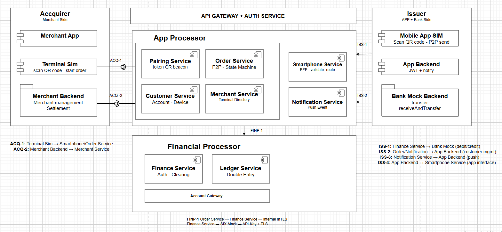

## 1. Giới thiệu

### 1.1 Mục đích
Tài liệu này đặc tả yêu cầu phần mềm cho TWINT-Inspired Payment Platform — nền tảng thanh toán kiến trúc microservices, mô phỏng theo hệ thống thanh toán TWINT của Thụy Sĩ, hỗ trợ hai luồng thanh toán chính: P2P Transfer (chuyển tiền ngang hàng qua số điện thoại) và Merchant Payment (thanh toán tại điểm bán qua QR code). 
Tài liệu bao gồm thiết kế kiến trúc, phân rã service, state machine, database schema và chiến lược mock external systems.
### 1.2 Phạm vi
Sản phẩm cung cấp:

- Merchant Payment flow: QR generation, pairing session, authorization, capture
- P2P Transfer flow: phone number resolution, atomic transfer, dual notification
- Order state machine đầy đủ với timeout handling và compensating transaction
- Outbox pattern đảm bảo at-least-once delivery cho Kafka events
- Idempotency tại smartphone-service và ledger layer chống duplicate transaction
- Mock external systems: SIX Clearing Service, Bank Core Service

**Ngoài phạm vi:** kết nối ngân hàng thật, license thanh toán, KYC thật, AML/fraud detection thật, loyalty/campaign, settlement thật với đối tác.

### 1.3 Định nghĩa & thuật ngữ

| Term | Definition |
|---|---|
| SRD | Software Requirements Document |
| P2P | Peer-to-Peer — chuyển tiền trực tiếp giữa 2 user |
| QR | Quick Response code — mã quét để khởi tạo payment session |
| Pairing | Session tạm thời nối merchant terminal với customer app |
| Acquirer | Bên đại diện merchant trong giao dịch thanh toán |
| Issuer | Bên đại diện customer / ngân hàng phát hành |
| Schema | Platform trung gian điều phối giữa Acquirer và Issuer |
| FINP | Financial Processor interface — kết nối Schema với SIX Clearing |
| ACQ | Acquirer interface — kết nối Merchant với Schema |
| ISS | Issuer interface — kết nối Schema với App/Bank |
| authCode | Mã xác thực từ clearing service sau khi reserve thành công |
| Outbox | Pattern đảm bảo DB write và Kafka publish trong cùng transaction |
| DLQ | Dead Letter Queue — hàng đợi chứa message xử lý thất bại |
| TTL | Time To Live — thời gian sống của token/session |
| TPS | Transactions Per Second |
| P99 | 99th percentile latency |

### 1.4 Tài liệu tham chiếu

- TWINT Payment System Architecture — internal diagrams
- Spring Boot 3.x / Spring Cloud 2023.x docs
- PostgreSQL 16.x documentation
- Redis 7.x OSS docs
- Apache Kafka 3.x / Redpanda docs
- Keycloak 24.x admin guide
- OpenTelemetry Specification 1.30+
- Resilience4j documentation

### 2.2 Các nhóm chức năng chính

| ID | Nhóm chức năng | Trạng thái |
|---|---|---|
| F1 | Pairing Management | ✅ Có |
| F2 | Order Management | ✅ Có |
| F3 | Customer Management | ✅ Có |
| F4 | Merchant Management | ✅ Có |
| F5 | Authentication & Authorization | ✅ Có |
| F6 | API Gateway & Routing | ✅ Có |
| F7 | Asynchronous Messaging | ✅ Có (Kafka) |
| F8 | Distributed Caching & Token TTL | ✅ Có (Redis) |
| F9 | P2P Transfer Flow | 🆕 Đề xuất |
| F10 | Merchant Payment Flow | 🆕 Đề xuất |
| F11 | Order State Machine | 🆕 Đề xuất |
| F12 | Outbox Pattern | 🆕 Đề xuất |
| F13 | Idempotency & Duplicate Prevention | 🆕 Đề xuất |
| F14 | Notification Fan-out | 🆕 Đề xuất |
| F15 | Mock External Clearing & Bank | 🆕 Đề xuất |
| F16 | Observability (Tracing/Metrics/Logs) | ⚠️ Một phần (Jaeger) |

### 2.3 Phân loại người dùng

| Persona | Mô tả | Quyền |
|---|---|---|
| **Customer** | Người dùng mobile app | Scan QR, P2P send, view history, receive notification |
| **Merchant** | Quản lý cửa hàng | Start order, confirm payment, view settlement |
| **Admin** | Quản trị hệ thống | Toàn quyền, lock/unlock account, dashboard |
| **System** | Internal actor | Timeout handler, outbox scheduler, reconciliation job |

### 2.4 Ràng buộc & giả định

- Triển khai trên VPS 4CPU / 6GB RAM với Docker Compose, có thể mở rộng lên Kubernetes
- Java 17, Spring Boot 3.x, Spring Cloud 2023.x
- PostgreSQL 16.x là DB chính — mỗi service một schema riêng trong cùng instance
- Redis 7.x cho token TTL, idempotency key, rate limiting
- Kafka 3.x (hoặc Redpanda) cho async messaging và Outbox pattern
- Keycloak là Identity Provider — JWT cho mobile, session cho web portal
- SIX Clearing Service và Bank Core Service là stub nội bộ, simulate external systems
- Tất cả service stateless, scale ngang được
- Không có FK cross-service — mỗi service chỉ reference UUID của service khác qua API call

## 3 Kiến trúc tổng thể

### 3.1 Sơ đồ logic


### 3.2 Phân rã service

| Service | Ngôn ngữ | Port | DB | Phụ thuộc |
|---|---|---|---|---|
| api-gateway | Java/WebFlux | 8080 | — | Keycloak, Redis |
| order-service | Java | 8081 | PostgreSQL (order_db) | Kafka, Redis, Feign→Pairing, Feign→Customer, Feign→Merchant |
| pairing-service | Java | 8082 | PostgreSQL (pairing_db) | Redis (token TTL) |
| customer-service | Java | 8083 | PostgreSQL (customer_db) | — |
| merchant-service | Java | 8084 | PostgreSQL (merchant_db) | — |
| smartphone-service | Java | 8181 | — | Feign→Order, Keycloak |
| notification-service | Java | 8182 | PostgreSQL (notification_db) | Kafka |
| six-clearing-service | Java | 9081 | — | — |
| bank-core-service | Java | 9082 | — | — |

## 4. Yêu cầu chức năng (Functional Requirements)

### F1 — Pairing Management
**User Story:** *Là một customer, tôi muốn quét QR code tại terminal của merchant để khởi tạo phiên thanh toán; hệ thống phải đảm bảo token chỉ dùng được 1 lần và hết hạn sau 30 giây nếu không có ai quét.*

| ID | Yêu cầu |
|---|---|
| F1.1 | Merchant gọi `POST /v1/pairings` để tạo pairing session — hệ thống sinh token, QR code và lưu vào Redis với TTL 30s |
| F1.2 | App gọi `POST /v1/pairings/scan` với token — hệ thống validate token (còn hạn, chưa dùng, chưa blacklist) và attach customerId vào pairing |
| F1.3 | Sau khi scan thành công, pairing state chuyển `CREATED → SCANNED` — merchant nhận notification để hiển thị thông tin customer |
| F1.4 | Token bị blacklist ngay sau khi dùng (Redis `SET token:used EX 3600`) — mọi request dùng lại token cũ trả 409 `TOKEN_ALREADY_USED` |
| F1.5 | Scheduler quét pairing ở state `CREATED` có `expires_at < NOW()` → chuyển sang `EXPIRED` |
| F1.6 | Customer gọi `POST /v1/pairings/{id}/cancel` để huỷ pairing đang ở state `SCANNED` → chuyển sang `CANCELLED` |
| F1.7 | API `GET /v1/pairings/{id}` trả state hiện tại để merchant polling |

**Acceptance:**
- Token không thể dùng 2 lần trong mọi tình huống kể cả concurrent request
- Pairing expired đúng TTL cấu hình (default 30s)
- P99 latency scan token < 100ms

---

### F2 — Order Management
**User Story:** *Là một customer, tôi muốn xác nhận thanh toán sau khi quét QR; hệ thống phải đảm bảo order đi đúng state machine và không bao giờ mất tiền dù service crash giữa chừng.*

| ID | Yêu cầu |
|---|---|
| F2.1 | Merchant gọi `POST /v1/orders` với `pairingId`, `amount`, `currency` — order-service tạo Order với state `RECEIVED` |
| F2.2 | Order write và outbox_event write nằm trong cùng 1 PostgreSQL transaction |
| F2.3 | Sau khi app scan QR thành công, order-service attach customerId vào order → state chuyển `RECEIVED → PAIRED` |
| F2.4 | Order-service gọi customer-service lấy thông tin account và financialAccount — nếu customer không eligible trả 422 |
| F2.5 | Order-service gọi six-clearing-service `POST /finp/v1/reserve` để giữ tiền — nhận `authCode` → state chuyển `PAIRED → WAITING_BANK_AUTH` |
| F2.6 | Nếu `merchantConfirmationFlag = true`, order dừng ở `WAITING_MERCHANT_UPDATE` chờ merchant confirm thủ công |
| F2.7 | Merchant gọi `POST /v1/orders/{id}/confirm` — order-service trả `202 Accepted` ngay, tiếp tục xử lý advice async |
| F2.8 | Order-service gọi six-clearing-service `POST /finp/v1/advice` để capture tiền → state chuyển `ADVICE_PENDING → SUCCESSFUL` |
| F2.9 | Mọi state transition được ghi vào `order_state_history` (append-only) |
| F2.10 | Sau khi SUCCESSFUL, publish event `order.successful` lên Kafka (fire-and-forget, không block response) |
| F2.11 | Customer hoặc merchant gọi `POST /v1/orders/{id}/cancel` để huỷ order đang ở state `PAIRED` hoặc `WAITING_MERCHANT_UPDATE` |
| F2.12 | `GET /v1/orders/{id}` trả thông tin order kèm state hiện tại |
| F2.13 | `GET /v1/orders?customerId=&page=&size=` trả lịch sử order của customer |

**Acceptance:**
- Order không bao giờ mất tiền dù order-service crash giữa bước reserve và advice
- Idempotency key đảm bảo không tạo 2 order từ cùng 1 request
- State machine không bao giờ đi sai chiều (chỉ forward, không backward)

---

### F3 — Customer Management
**User Story:** *Là một customer, tôi muốn đăng ký tài khoản, liên kết số điện thoại và tài khoản ngân hàng để có thể nhận và gửi tiền.*

| ID | Yêu cầu |
|---|---|
| F3.1 | Tạo customer account `POST /v1/customers` với `phoneNumber`, `alias` — mặc định `kycStatus: PENDING` |
| F3.2 | `GET /v1/customers/{id}` trả thông tin account, danh sách device, danh sách financialAccount |
| F3.3 | Thêm device `POST /v1/customers/{id}/devices` với `fingerprint`, `certificate` — mỗi customer tối đa 3 device active |
| F3.4 | Revoke device `DELETE /v1/customers/{id}/devices/{deviceId}` — device chuyển status `REVOKED` |
| F3.5 | Thêm financial account `POST /v1/customers/{id}/financial-accounts` với `iban`, `bankCode`, `issuerId` |
| F3.6 | Set P2P default `PUT /v1/customers/{id}/financial-accounts/{faId}/p2p-default` — đảm bảo chỉ 1 account là default (partial unique index) |
| F3.7 | `GET /v1/customers/resolve?phone=` — resolve customer theo số điện thoại, dùng trong P2P flow |
| F3.8 | `POST /v1/customers/{id}/p2p/check` — kiểm tra customer có eligible để P2P không (status ACTIVE, có p2p default account, KYC VERIFIED) |
| F3.9 | `GET /v1/customers/p2p-recipient?phone=` — resolve receiver trong P2P flow, trả `customerId` + `p2pDefaultAccountId` |
| F3.10 | Update KYC status `PUT /v1/customers/{id}/kyc` — chỉ ADMIN mới có quyền |
| F3.11 | Block/unblock customer `PUT /v1/customers/{id}/status` — chỉ ADMIN mới có quyền |

**Acceptance:**
- Không thể có 2 customer cùng `phoneNumber`
- Không thể có 2 `financial_account` cùng `is_p2p_default = true` cho 1 customer
- `resolve?phone=` phải trả kết quả < 50ms (có index trên phone_number)

---

### F4 — Merchant Management
**User Story:** *Là một merchant, tôi muốn đăng ký cửa hàng, thêm terminal và cấu hình confirmation flag để kiểm soát luồng thanh toán.*

| ID | Yêu cầu |
|---|---|
| F4.1 | Tạo merchant `POST /v1/merchants` với `name`, `mcc`, `confirmationFlag` |
| F4.2 | `GET /v1/merchants/{id}` trả thông tin merchant kèm danh sách terminal |
| F4.3 | Thêm terminal `POST /v1/merchants/{id}/terminals` với `terminalCode`, `type` (`EFTPOS`, `ESHOP`, `MOBILE`) |
| F4.4 | `GET /v1/merchants/{id}/terminals/{terminalId}` trả thông tin terminal |
| F4.5 | Update confirmation flag `PUT /v1/merchants/{id}/confirmation-flag` — bật/tắt yêu cầu merchant confirm thủ công |
| F4.6 | Deactivate terminal `PUT /v1/merchants/{id}/terminals/{terminalId}/status` |
| F4.7 | `GET /v1/merchants/resolve?terminalCode=` — resolve merchant theo terminal code, dùng trong pairing flow |

**Acceptance:**
- `terminalCode` là UNIQUE toàn hệ thống
- `confirmationFlag` thay đổi có hiệu lực ngay với order tiếp theo, không ảnh hưởng order đang xử lý

---

### F5 — Authentication & Authorization
| ID | Yêu cầu |
|---|---|
| F5.1 | Mobile app đăng nhập qua Keycloak → nhận JWT token |
| F5.2 | API Gateway validate JWT (issuer, audience, expiration, signature) trên mọi request |
| F5.3 | Gateway inject header `X-User-Id`, `X-User-Role`, `X-Trace-Id` cho downstream service |
| F5.4 | Role-based access: `ROLE_CUSTOMER`, `ROLE_MERCHANT`, `ROLE_ADMIN`, `ROLE_SYSTEM` |
| F5.5 | Merchant backend dùng API Key + HMAC signature cho ACQ interfaces |
| F5.6 | Schema gọi Issuer dùng Webhook HMAC-SHA256 signature |
| F5.7 | Internal service-to-service call dùng mTLS hoặc internal JWT |
| F5.8 | Token refresh endpoint — Keycloak issue refresh token TTL 24h |

---

### F6 — API Gateway & Routing
| ID | Yêu cầu |
|---|---|
| F6.1 | Gateway định tuyến request đến đúng service theo path prefix |
| F6.2 | Gateway thêm header `X-Trace-Id` (UUID v4) nếu request chưa có |
| F6.3 | Health check `GET /actuator/health` expose cho mọi service |
| F6.4 | Gateway trả 401 nếu JWT invalid, 403 nếu không đủ quyền, 429 nếu rate limit |
| F6.5 | Rate limit per user: 100 req/phút cho CUSTOMER, 500 req/phút cho MERCHANT |

---

### F7 — Asynchronous Messaging
| ID | Yêu cầu |
|---|---|
| F7.1 | Kafka topics: `order.events`, `notification.events` |
| F7.2 | Order-service publish event sau mỗi state transition thành công |
| F7.3 | Notification-service consume `order.events` để gửi notify cho customer và merchant |
| F7.4 | Mọi Kafka message có header `traceId`, `eventType`, `timestamp`, `aggregateId` |
| F7.5 | Consumer retry 3 lần với backoff (1s, 5s, 30s) trước khi đẩy vào DLQ |
| F7.6 | DLQ topic: `order.events.dlq`, `notification.events.dlq` |

---

### F8 — Distributed Caching & Token TTL
| ID | Yêu cầu |
|---|---|
| F8.1 | Pairing token lưu Redis với TTL 30s — key pattern `pairing:token:{token}` |
| F8.2 | Token blacklist lưu Redis với TTL 1h — key pattern `pairing:used:{token}` |
| F8.3 | Idempotency key lưu Redis với TTL 24h — key pattern `idempotency:{key}` |
| F8.4 | Rate limit counter lưu Redis — key pattern `ratelimit:{userId}:{window}` |
| F8.5 | Customer resolve cache lưu Redis TTL 5 phút — key pattern `customer:phone:{phone}` |

---

### F9 — P2P Transfer Flow 🆕
**User Story:** *Là một customer, tôi muốn chuyển tiền cho bạn bè bằng số điện thoại mà không cần biết số tài khoản ngân hàng; tiền phải được chuyển ngay lập tức và cả 2 bên đều nhận được thông báo.*

| ID | Yêu cầu |
|---|---|
| F9.1 | App gọi `POST /v1/orders/p2p/send` qua smartphone-service với `receiverPhone`, `amount`, `currency`, `idempotencyKey` |
| F9.2 | Smartphone-service check `resendOrderUuid` — nếu không null thì trả lại kết quả của order cũ (idempotency) |
| F9.3 | Order-service resolve receiver qua customer-service `GET /v1/customers/p2p-recipient?phone=` |
| F9.4 | Order-service check sender eligible qua customer-service `POST /v1/customers/{id}/p2p/check` |
| F9.5 | Order-service persist P2P Order với state `PENDING` |
| F9.6 | Order-service gọi bank-core-service `POST /portfolios/{fromUuid}/p2pMoney/reserveAndTransfer` — atomic debit sender + credit receiver |
| F9.7 | Nếu transfer thành công, order chuyển state `PENDING → SUCCESSFUL` |
| F9.8 | Nếu transfer thất bại (insufficient funds, receiver not found, bank error), order chuyển state `PENDING → FAILED` — không cần rollback vì atomic |
| F9.9 | Publish event `order.successful` hoặc `order.failed` lên Kafka |
| F9.10 | Notification-service gửi notify cho cả sender ("Đã chuyển X VND") và receiver ("Nhận được X VND từ Y") |

**Acceptance:**
- Không bao giờ debit sender mà không credit receiver (atomic)
- Duplicate request với cùng `idempotencyKey` trả cùng kết quả
- P99 latency toàn bộ P2P flow < 500ms

---

### F10 — Merchant Payment Flow 🆕
**User Story:** *Là một customer, tôi muốn thanh toán tại quầy bằng cách quét QR code trên terminal; merchant phải nhận được xác nhận thanh toán ngay khi tôi xác nhận trên app.*

| ID | Yêu cầu |
|---|---|
| F10.1 | Merchant gọi `POST /v1/orders` → order-service tạo order `RECEIVED`, gọi pairing-service tạo QR, trả `orderId + qrCode` cho merchant |
| F10.2 | Customer quét QR → app gọi `POST /v1/pairings/scan` → pairing-service validate token → order chuyển `RECEIVED → PAIRED` |
| F10.3 | Order-service gọi customer-service lấy thông tin financialAccount của customer |
| F10.4 | Order-service gọi six-clearing-service `POST /finp/v1/reserve` → nhận authCode → order chuyển `PAIRED → WAITING_BANK_AUTH` |
| F10.5 | Nếu `merchantConfirmationFlag = false`, order bỏ qua `WAITING_MERCHANT_UPDATE`, chuyển thẳng sang `ADVICE_PENDING` |
| F10.6 | Nếu `merchantConfirmationFlag = true`, order dừng ở `WAITING_MERCHANT_UPDATE` — merchant có tối đa 5 phút để confirm |
| F10.7 | Merchant gọi `POST /v1/orders/{id}/confirm` → order-service trả `202 Accepted` ngay → tiếp tục gọi advice async |
| F10.8 | Order-service gọi six-clearing-service `POST /finp/v1/advice` → captured ok → order chuyển `ADVICE_PENDING → SUCCESSFUL` |
| F10.9 | Publish `order.successful` lên Kafka → notification-service notify merchant và customer |
| F10.10 | Nếu merchant không confirm trong 5 phút → timeout handler gọi `POST /finp/v1/cancellation` release reservation → order chuyển `TIMEOUT` |

**Acceptance:**
- Reservation luôn được release khi order về TIMEOUT hoặc CANCELLED
- `202 Accepted` trả về merchant trong < 200ms
- Không bao giờ capture tiền 2 lần cho cùng 1 order

---

### F11 — Order State Machine 🆕
| ID | Yêu cầu |
|---|---|
| F11.1 | Order state machine merchant: `RECEIVED → PAIRED → WAITING_BANK_AUTH → [WAITING_MERCHANT_UPDATE] → ADVICE_PENDING → SUCCESSFUL` |
| F11.2 | Order state machine P2P: `PENDING → SUCCESSFUL` hoặc `PENDING → FAILED` |
| F11.3 | Terminal states fail: `FAILED`, `FAILED_AFTER_CONFIRMATION`, `TIMEOUT`, `CANCELLED_BY_APP`, `CANCELLED_BY_MERCHANT` |
| F11.4 | Không bao giờ transition ngược chiều — mọi attempt sẽ throw `InvalidStateTransitionException` |
| F11.5 | Mọi transition ghi vào `order_state_history` với `fromState`, `toState`, `trigger`, `actor`, `changedAt` |
| F11.6 | Scheduler chạy mỗi 30s quét order `WAITING_MERCHANT_UPDATE` có `expires_at < NOW()` → trigger timeout handler |
| F11.7 | Timeout handler: gọi cancellation lên six-clearing-service → update state `TIMEOUT` → publish event |

---

### F12 — Outbox Pattern 🆕
| ID | Yêu cầu |
|---|---|
| F12.1 | Mỗi service có bảng `order_outbox(id, order_id, order_type, event_type, payload, status, retry_count, created_at, published_at)` |
| F12.2 | Business write (update order state) và outbox write nằm trong 1 PostgreSQL transaction |
| F12.3 | Scheduler quét `order_outbox` có `status = PENDING` mỗi 1s → publish lên Kafka → update `status = PUBLISHED` |
| F12.4 | Nếu publish fail, retry tối đa 3 lần với backoff (1s, 5s, 30s) → sau đó `status = FAILED` + alert |
| F12.5 | Index `(status, created_at)` trên outbox table để scheduler query hiệu quả |
| F12.6 | Cleanup job xóa outbox records có `status = PUBLISHED` và `published_at > 24h` |

---

### F13 — Idempotency & Duplicate Prevention 🆕
| ID | Yêu cầu |
|---|---|
| F13.1 | Mọi POST endpoint tạo order yêu cầu header `Idempotency-Key` |
| F13.2 | Smartphone-service check Redis `GET idempotency:{key}` trước khi forward request xuống order-service |
| F13.3 | Nếu key tồn tại → trả lại cached response, không tạo order mới |
| F13.4 | Nếu key chưa tồn tại → set `idempotency:{key} = PROCESSING` → forward request → sau khi xong set `idempotency:{key} = {response}` TTL 24h |
| F13.5 | `order.idempotency_key` có UNIQUE constraint ở DB — lưới cuối cùng chặn duplicate |
| F13.6 | Concurrent request với cùng key → chỉ 1 request được xử lý, request còn lại nhận 409 `DUPLICATE_REQUEST` |

---

### F14 — Notification Fan-out 🆕
**User Story:** *Sau khi payment thành công, cả customer và merchant đều nhận được thông báo ngay lập tức qua push notification.*

| ID | Yêu cầu |
|---|---|
| F14.1 | Notification-service consume Kafka topic `order.events` |
| F14.2 | Với event `order.successful` → gửi notify cho customer ("Thanh toán thành công X VND") và merchant ("Nhận được thanh toán X VND") |
| F14.3 | Với event `order.failed` → gửi notify cho customer ("Thanh toán thất bại, vui lòng thử lại") |
| F14.4 | Với event `order.timeout` → gửi notify cho merchant ("Đơn hàng hết hạn") và customer ("Phiên thanh toán đã hết hạn") |
| F14.5 | Phase 1: push notification qua WebSocket hoặc log — không cần tích hợp FCM/APNs thật |
| F14.6 | Mỗi notification lưu vào `notification_message` với `status: PENDING → SENT / FAILED` |
| F14.7 | Retry notify thất bại tối đa 3 lần → sau đó `status = FAILED` |
| F14.8 | `GET /v1/notifications?recipientId=&page=` — customer/merchant xem lịch sử notification |

---

### F15 — Mock External Clearing & Bank 🆕
| ID | Yêu cầu |
|---|---|
| F15.1 | `six-clearing-service` expose 3 endpoints: `POST /finp/v1/reserve`, `POST /finp/v1/advice`, `POST /finp/v1/cancellation` |
| F15.2 | Scenario được điều khiển qua header `X-MOCK-SCENARIO`: `HAPPY`, `INSUFFICIENT_FUNDS`, `AUTH_DENIED`, `LIMIT_EXCEEDED`, `FINP_500`, `TIMEOUT:{ms}`, `FLAKY` |
| F15.3 | `bank-core-service` expose: `POST /portfolios/{uuid}/transfer`, `POST /portfolios/{uuid}/p2pMoney/reserveAndTransfer`, `GET /portfolios/{uuid}/balance` |
| F15.4 | Bank mock dùng in-memory balance store — `PUT /mock/balance/{uuid}` để set balance |
| F15.5 | Cả 2 mock service expose `GET /mock/txn-log` để xem audit log tất cả calls |
| F15.6 | `POST /mock/reset` để reset toàn bộ state về initial |
| F15.7 | Mock implement idempotency — cùng request trả cùng response |

---

### F16 — Observability ⚠️
| ID | Yêu cầu |
|---|---|
| F16.1 | OpenTelemetry instrumentation cho mọi service — auto-instrument Spring Boot |
| F16.2 | Trace ID sinh tại API Gateway, propagate qua HTTP header `X-Trace-Id` và Kafka message header |
| F16.3 | Mọi log entry có MDC fields: `traceId`, `spanId`, `userId`, `orderId` |
| F16.4 | Distributed trace UI qua Jaeger |
| F16.5 | Metrics export Prometheus — JVM metrics, request rate, error rate, Kafka lag |
| F16.6 | Alert rule: error rate > 1%, P99 latency > 1s, outbox PENDING > 100 records |

## 5. Yêu cầu phi chức năng (Non-Functional Requirements)

### 5.1 Hiệu năng (Performance)

| Metric | Target |
|---|---|
| API P99 latency (read cached) | < 100ms |
| API P99 latency (write) | < 500ms |
| P2P transfer P99 latency (end-to-end) | < 500ms |
| Merchant payment confirm P99 | < 200ms |
| Pairing token validate P99 | < 100ms |
| Notification delivery latency | < 5s sau khi order SUCCESSFUL |
| Outbox scheduler publish latency | < 2s sau khi event PENDING |

### 5.2 Khả năng mở rộng (Scalability)

- Tất cả service stateless, scale ngang bằng Docker Compose replicas hoặc Kubernetes HPA
- PostgreSQL 1 instance với nhiều schema — nâng lên read replica khi cần (phase 3)
- Redis single node (phase 1) → Redis Cluster mode khi tải tăng (phase 3)
- Kafka tối thiểu 1 broker (dev) → 3 brokers replication factor 3 (production)
- Pairing token store Redis với TTL — không giữ state trên service instance
- Idempotency store Redis TTL 24h — scale out không ảnh hưởng correctness

### 5.3 Độ tin cậy (Reliability)

| Metric | Target |
|---|---|
| Availability | 99.9% (~8.7h downtime/năm) |
| RPO | ≤ 5 phút |
| RTO | ≤ 30 phút |
| Data durability | PostgreSQL WAL + daily backup; Kafka acks=all RF=3 |
| No money lost | Outbox + idempotency đảm bảo at-least-once, không duplicate charge |
| Circuit breaker | Resilience4j — 50% error rate trong 10s → open 30s cho six-clearing-service và bank-core-service |
| Retry policy | Exponential backoff (1s, 5s, 30s), max 3 lần cho idempotent operation |
| Timeout handler | Scheduler mỗi 30s quét WAITING_MERCHANT_UPDATE hết hạn → auto cancel + release reservation |
| DLQ | Kafka DLQ cho mọi consumer — message không xử lý được sau 3 retry |

### 5.4 Bảo mật (Security)

- TLS 1.3 cho mọi external traffic (ACQ, ISS interfaces)
- mTLS hoặc internal JWT cho service-to-service call trong Schema zone
- JWT validation tại API Gateway — inject `X-User-Id`, `X-User-Role` cho downstream
- API Key + HMAC-SHA256 signature cho ACQ interfaces (Merchant → Schema)
- Webhook HMAC-SHA256 signature cho ISS interfaces (Schema → Issuer)
- Pairing token là nonce — blacklist ngay sau khi dùng, không thể replay
- QR payload signed bằng HMAC-SHA256 + timestamp để chống tamper
- Secrets không bao giờ hardcode trong code — dùng environment variable hoặc Docker secrets
- Rate limit chống brute-force: 5 lần sai token / 15 phút / IP → block
- Audit log mọi action ADMIN-level (`lock/unlock customer`, `update KYC`) — lưu append-only
- `order_state_history` immutable — không UPDATE, không DELETE

### 5.5 Khả năng quan sát (Observability)

- 100% service emit metrics, logs, traces theo OpenTelemetry
- Trace ID sinh tại API Gateway, propagate qua HTTP header `X-Trace-Id` và Kafka message header
- Mọi log entry có MDC: `traceId`, `spanId`, `userId`, `orderId`, `service`
- Distributed trace UI qua Jaeger
- Metrics export Prometheus — JVM, request rate, error rate, Kafka consumer lag, outbox pending count
- Alert rule:
    - Error rate > 1% trong 5 phút
    - P99 latency > 1s
    - Outbox `PENDING` records > 100 trong 5 phút
    - Kafka consumer lag > 1000 message
    - Order ở `WAITING_MERCHANT_UPDATE` quá 10 phút (stuck order)

### 5.6 Khả năng bảo trì (Maintainability)

- Code coverage ≥ 70% unit test + ≥ 40% integration test
- Mỗi service có OpenAPI 3.0 spec — auto-generate từ Spring annotations
- State machine có unit test cover toàn bộ valid và invalid transitions
- Mỗi repo có CI pipeline: build → test → container build → deploy local
- ADR (Architecture Decision Record) cho các quyết định lớn:
    - Lý do chọn orchestration thay vì choreography cho order flow
    - Lý do dùng Outbox thay vì dual-write
    - Lý do không dùng FK cross-service

### 5.7 Khả năng tương thích (Compatibility)

- API versioning `/v1` — backward-compatible, không breaking change trong cùng version
- Kafka event schema tự document trong README — forward compatible (thêm field mới không break consumer cũ)
- Mock stubs implement đúng interface contract — swap sang real implementation không cần thay đổi code caller

### 5.8 Tuân thủ (Compliance)

- Không lưu thông tin tài khoản ngân hàng thật — `iban` trong `financial_account` chỉ là mock data
- `phoneNumber` là PII — không log raw phone number, mask khi cần (`*******789`)
- Customer có quyền xem lịch sử transaction của mình `GET /v1/orders?customerId=`
- `order_state_history` giữ đầy đủ audit trail — không xóa, không sửa
- Outbox records xóa sau 24h chỉ khi đã `PUBLISHED` — không xóa `FAILED` records trước khi review

## 6. Yêu cầu về dữ liệu

## 6. Yêu cầu về dữ liệu

### 6.1 Mô hình dữ liệu chính

**order-service** (`order_db`)
```
Order (id, type, state, amount, currency, sender_account_id, receiver_account_id,
       merchant_id, terminal_id, pairing_id, auth_code, txn_ref,
       idempotency_key, cancel_reason, expires_at, completed_at, created_at, updated_at)

OrderStateHistory (id, order_id, from_state, to_state, trigger, changed_at)

OrderOutbox (id, order_id, order_type, event_type, payload, status,
             retry_count, created_at, published_at)
```

**customer-service** (`customer_db`)
```
Customer (id, phone_number, alias, kyc_status, status, created_by, created_at, updated_at)

Device (id, customer_id, fingerprint, certificate, payload, status,
        is_active, registered_at, revoked_at)

FinancialAccount (id, customer_id, iban, bank_code, issuer_id,
                  is_p2p_default, status, created_at, updated_at)
```

**pairing-service** (`pairing_db`)
```
Pairing (id, token, qr_code, merchant_id, terminal_id, customer_id,
         state, expires_at, created_at, updated_at)
```

**merchant-service** (`merchant_db`)
```
Merchant (id, name, mcc, confirmation_flag, status, created_at, updated_at)

Terminal (id, merchant_id, terminal_code, type, status, created_at, updated_at)
```

**notification-service** (`notification_db`)
```
NotificationMessage (id, recipient_id, recipient_type, type, channel, payload,
                     status, order_id, is_read, retry_count, sent_at, created_at)
```

---

### 6.2 Phân tầng lưu trữ

| Loại data | Storage | Lý do |
|---|---|---|
| Transactional (Order, Customer, Pairing, Merchant) | PostgreSQL | ACID, relational, per-service schema |
| Pairing token + TTL | Redis | Atomic check + expire, blacklist |
| Idempotency key | Redis TTL 24h | Fast lookup, tránh duplicate |
| Rate limit counter | Redis | Atomic INCR, sliding window |
| Customer phone resolve cache | Redis TTL 5m | Giảm tải customer-service |
| Event log | Kafka (retention 7 ngày) | Replay, decoupling, async |
| Distributed trace | Jaeger | Cross-service trace |
| Metric | Prometheus | Time-series, alert |

---

### 6.3 Data retention

| Loại | Thời gian | Lý do |
|---|---|---|
| Order | Vĩnh viễn (không xóa) | Financial audit trail |
| OrderStateHistory | Vĩnh viễn (append-only) | Audit, debug |
| OrderOutbox | 24h sau khi PUBLISHED | Đã publish thì không cần giữ |
| Customer | Vĩnh viễn | Compliance |
| Pairing | 7 ngày sau khi COMPLETED/EXPIRED | Debug |
| NotificationMessage | 90 ngày | Lịch sử thông báo |
| Kafka event | 7 ngày | Replay nếu consumer lag |
| Pairing token Redis | 30s (TTL) | Hết hạn tự xóa |
| Idempotency key Redis | 24h (TTL) | Đủ để chặn duplicate |
| Trace (Jaeger) | 14 ngày | Debug production issue |

---

### 6.4 Lưu ý quan trọng về data

- **Không có FK cross-service** — mọi reference giữa service chỉ là UUID lưu làm logical reference, không enforce bằng DB constraint
- **order_state_history và order_outbox là append-only** — không UPDATE, không DELETE trong business flow
- **financial_account.is_p2p_default** có partial unique index đảm bảo mỗi customer chỉ có 1 tài khoản P2P mặc định
- **customer.phone_number** có UNIQUE constraint — không thể 2 customer cùng số điện thoại
- **order.idempotency_key** có UNIQUE constraint — lưới cuối cùng chặn duplicate order ở tầng DB
- **Không lưu thông tin ngân hàng thật** — `iban`, `bank_code` là mock data, không có giá trị thật trong phase 1

## 7. Yêu cầu giao diện ngoài

### 7.1 API

- RESTful JSON, mã hóa UTF-8
- Versioning qua URL path (`/v1`, `/v2`)
- Pagination dạng page/size cho list endpoint (`?page=0&size=20`)
- Error response chuẩn RFC 7807 Problem Details:

```json
{
  "type": "https://api.twint.scheme/errors/insufficient-funds",
  "title": "Insufficient Funds",
  "status": 422,
  "detail": "Sender account does not have enough balance",
  "traceId": "4bf92f3577b34da6a3ce929d0e0e4736",
  "orderId": "ORD-001"
}
```

- Header bắt buộc trên mọi request:
    - `Authorization: Bearer {jwt}` — cho customer/merchant endpoints
    - `X-Idempotency-Key: {uuid}` — bắt buộc trên POST tạo order
    - `X-Api-Key: {key}` — cho ACQ interfaces (merchant backend)
    - `X-Trace-Id: {uuid}` — optional, Gateway sinh nếu thiếu

---

### 7.2 Tích hợp bên ngoài

| Hệ thống | Mục đích | Giao thức | Ghi chú |
|---|---|---|---|
| Keycloak | Identity Provider — JWT issue, validate | OIDC / REST | JWT mobile, session web portal |
| six-clearing-service | Reserve, advice, cancellation | REST + HMAC | Stub nội bộ — simulate SIX Swiss Clearing |
| bank-core-service | Transfer, reserveAndTransfer, balance | REST + API Key | Stub nội bộ — simulate core banking |
| WebSocket | Push notification realtime cho App và Merchant | WebSocket | Phase 1 thay FCM/APNs |
| FCM / APNs | Push notification mobile | HTTP/2 | Phase 2 — thay WebSocket |

---

### 7.3 Interface giữa các zone

**ACQ Interfaces** — Merchant → Schema

| Interface | Endpoint | Bảo mật |
|---|---|---|
| ACQ-1 Transaction | `POST /v1/orders` | API Key + HMAC-SHA256 |
| ACQ-2 Notification | Webhook từ Schema → Merchant | HMAC-SHA256 signature |
| ACQ-3 Merchant Mgmt | `GET/PUT /v1/merchants` | API Key |

**ISS Interfaces** — Schema ↔ Issuer

| Interface | Endpoint | Bảo mật |
|---|---|---|
| ISS-1 Transaction | `POST /portfolios/{uuid}/transfer` | API Key + TLS |
| ISS-2 Customer Mgmt | `GET /v1/customers/{uuid}` | Internal JWT |
| ISS-3 Notification | Webhook từ Schema → App Backend | HMAC-SHA256 signature |
| ISS-4 App Interface | `POST /v1/pairings/scan` | JWT (mobile user) |

**FINP Interface** — Schema → SIX Clearing

| Interface | Endpoint | Bảo mật |
|---|---|---|
| FINP-1 Reserve | `POST /finp/v1/reserve` | API Key + TLS |
| FINP-1 Advice | `POST /finp/v1/advice` | API Key + TLS |
| FINP-1 Cancellation | `POST /finp/v1/cancellation` | API Key + TLS |

---

### 7.4 Webhook format

Schema gọi vào Merchant hoặc App Backend theo format:

```json
{
  "eventType": "order.successful",
  "orderId": "ORD-001",
  "amount": 150000,
  "currency": "VND",
  "timestamp": "2025-07-11T10:30:00Z",
  "signature": "sha256=abc123..."
}
```

Receiver phải verify signature bằng HMAC-SHA256 với shared secret trước khi xử lý.
Nếu receiver không trả `200 OK` trong 5s, Schema retry tối đa 3 lần với backoff (1s, 5s, 30s).

## 8. Use case tiêu biểu (chi tiết)

### 8.1 UC-PAY-01: Merchant Payment — Thanh toán tại quầy qua QR

**Actor:** Merchant, Customer (đã login trên App)
**Pre-condition:** Merchant đã đăng ký terminal, Customer có tài khoản ACTIVE và financialAccount hợp lệ

**Happy Flow:**
1. Merchant nhập amount → gọi `POST /v1/orders` với `terminalId`, `amount`, `currency`
2. API Gateway validate API Key + HMAC signature, inject `X-Trace-Id`
3. Order Service tạo Order `RECEIVED`, gọi Pairing Service `findOrCreatePairing(qrCode)` → nhận `pairingId + token`
4. Order Service trả `orderId + qrCode` về Merchant — terminal hiển thị QR lên màn hình
5. Customer mở App, quét QR → App gọi `POST /v1/pairings/scan` với token
6. Pairing Service validate token (còn hạn, chưa blacklist) → attach `customerId` → state `SCANNED`
7. Order Service cập nhật Order `RECEIVED → PAIRED`, gọi Customer Service lấy `financialAccount`
8. Order Service gọi `POST /finp/v1/reserve` lên six-clearing-service → nhận `authCode` → Order `WAITING_BANK_AUTH`
9. Order Service check `merchantConfirmationFlag`:
    - `false` → chuyển thẳng sang `ADVICE_PENDING`
    - `true` → chuyển sang `WAITING_MERCHANT_UPDATE`, notify merchant chờ confirm
10. Merchant gọi `POST /v1/orders/{id}/confirm` → Order Service trả `202 Accepted` ngay
11. Order Service gọi `POST /finp/v1/advice` với `authCode` → captured ok → Order `ADVICE_PENDING → SUCCESSFUL`
12. Order Service ghi `order_state_history`, persist Order, write `order_outbox`
13. Scheduler publish `order.successful` lên Kafka
14. Notification Service consume event → notify Merchant ("Nhận được thanh toán") và Customer ("Thanh toán thành công")

**Exception:**
- Token hết hạn (> 30s) → 409 `TOKEN_EXPIRED`
- Token đã dùng → 409 `TOKEN_ALREADY_USED`
- Customer không eligible → 422 `CUSTOMER_NOT_ELIGIBLE`
- six-clearing-service trả auth denied → Order `FAILED`, notify customer
- six-clearing-service 5xx → Resilience4j retry 3 lần → circuit open → 503
- Merchant không confirm trong 5 phút → Timeout handler gọi `/finp/v1/cancellation` → Order `TIMEOUT`
- Advice fail sau khi reserve thành công → Order `FAILED_AFTER_CONFIRMATION` → alert DLQ, cần manual review
- Duplicate request cùng `Idempotency-Key` → trả lại cached response, không tạo order mới

---

### 8.2 UC-PAY-02: P2P Transfer — Chuyển tiền qua số điện thoại

**Actor:** Customer Sender (đã login), Customer Receiver (có tài khoản)
**Pre-condition:** Sender có tài khoản ACTIVE, KYC VERIFIED, có p2p default financialAccount. Receiver có số điện thoại đã đăng ký

**Happy Flow:**
1. Sender nhập số điện thoại receiver + amount → App gọi `POST /service/v1/orders/p2p/send` với `Idempotency-Key`
2. Smartphone Service validate request, check `resendOrderUuid`:
    - Không null → trả lại kết quả order cũ (idempotency)
    - Null → forward `POST /v1/orders/p2p/send` xuống Order Service
3. Order Service (P2Porchestration) gọi Customer Service:
    - `GET /v1/customers/{senderId}` — lấy thông tin sender
    - `POST /v1/customers/{senderId}/p2p/check` — check eligibility + limit
    - `GET /v1/customers/p2p-recipient?phone={receiverPhone}` — resolve receiver + p2pDefaultAccountId
4. Order Service persist P2P Order `PENDING`
5. Order Service gọi bank-core-service `POST /portfolios/{fromUuid}/p2pMoney/reserveAndTransfer`:
    - Atomic debit sender + credit receiver
    - Nếu thành công → nhận `txnRef`
6. Order Service cập nhật Order `PENDING → SUCCESSFUL`, ghi `order_state_history`, write `order_outbox`
7. Scheduler publish `order.successful` lên Kafka
8. Notification Service consume event:
    - Notify Sender: "Đã chuyển {amount} VND đến {receiverAlias}"
    - Notify Receiver: "Nhận được {amount} VND từ {senderAlias}"
9. Smartphone Service trả `P2PSendMoneyResponse` về App

**Exception:**
- Receiver phone không tồn tại → 404 `RECEIVER_NOT_FOUND`
- Sender không eligible (KYC pending, account blocked) → 422 `SENDER_NOT_ELIGIBLE`
- Insufficient funds → 422 `INSUFFICIENT_FUNDS`
- Daily limit exceeded → 422 `LIMIT_EXCEEDED`
- bank-core-service timeout → 504, Order `FAILED`
- Duplicate request cùng `Idempotency-Key` → trả lại cached response
- Debit sender thành công nhưng credit receiver fail → atomic rollback, Order `FAILED`, không mất tiền

---

### 8.3 UC-AUTH-01: Đăng nhập và xác thực

**Actor:** Customer hoặc Merchant
**Pre-condition:** Đã có tài khoản trên hệ thống

**Happy Flow:**
1. User gọi Keycloak login endpoint với `username/password`
2. Keycloak validate credentials → issue JWT (access token TTL 15m + refresh token TTL 24h)
3. App lưu JWT, đính kèm vào mọi request header `Authorization: Bearer {jwt}`
4. API Gateway intercept request → validate JWT (issuer, audience, expiration, signature)
5. Gateway inject `X-User-Id`, `X-User-Role` vào header → forward xuống service
6. Service downstream tin tưởng header từ Gateway, không validate JWT lại

**Exception:**
- Sai password → 401 `INVALID_CREDENTIALS`
- Account bị lock → 401 `ACCOUNT_LOCKED`
- JWT hết hạn → 401 `TOKEN_EXPIRED` → App dùng refresh token lấy JWT mới
- Refresh token hết hạn → buộc login lại

---

### 8.4 UC-OPS-01: Timeout handling — Order hết hạn tự động

**Actor:** System (Scheduler)
**Pre-condition:** Order ở state `WAITING_MERCHANT_UPDATE` quá `expires_at`

**Flow:**
1. Scheduler chạy mỗi 30 giây, query:
```sql
   SELECT * FROM "order"
   WHERE state = 'WAITING_MERCHANT_UPDATE'
   AND expires_at < NOW()
```
2. Với mỗi order tìm được:
    - Gọi `POST /finp/v1/cancellation` lên six-clearing-service để release reservation
    - Nếu cancellation thành công → update Order `TIMEOUT`, ghi `order_state_history`
    - Nếu cancellation fail → retry 3 lần → alert DLQ (reservation bị treo, cần manual review)
3. Write `order_outbox` với event `order.timeout`
4. Scheduler publish event lên Kafka
5. Notification Service consume → notify Merchant ("Đơn hàng hết hạn") và Customer ("Phiên thanh toán đã hết hạn")

**Exception:**
- six-clearing-service down khi cancel → reservation bị treo → alert `STUCK_RESERVATION` lên monitoring
- Order đã chuyển sang state khác giữa lúc query và lúc process → optimistic lock check, bỏ qua

---

### 8.5 UC-OPS-02: Outbox retry — Đảm bảo event được publish

**Actor:** System (Outbox Scheduler)
**Pre-condition:** `order_outbox` có records với `status = PENDING`

**Flow:**
1. Scheduler chạy mỗi 1 giây, query:
```sql
   SELECT * FROM order_outbox
   WHERE status = 'PENDING'
   ORDER BY created_at ASC
   LIMIT 100
```
2. Với mỗi record:
    - Publish message lên Kafka topic tương ứng với `event_type`
    - Thành công → update `status = PUBLISHED`, set `published_at = NOW()`
    - Thất bại → tăng `retry_count`, backoff (1s, 5s, 30s)
3. Nếu `retry_count >= 3` → update `status = FAILED`, trigger alert
4. Cleanup job chạy mỗi giờ xóa records có `status = PUBLISHED` và `published_at < NOW() - 24h`

**Exception:**
- Kafka broker down → toàn bộ PENDING records tích lũy → alert khi count > 100
- DB connection lost → scheduler tự retry khi connection restore

---

### 8.6 UC-MOCK-01: Test fail scenario với Mock Services

**Actor:** Developer / QA
**Pre-condition:** six-clearing-service và bank-core-service đang chạy

**Flow:**
1. Set global scenario: `PUT /mock/config/scenario` với body `{"scenario": "INSUFFICIENT_FUNDS"}`
2. Chạy P2P flow bình thường → bank-core-service trả 422 `INSUFFICIENT_FUNDS`
3. Verify Order về state `FAILED`, notification gửi đúng
4. Test timeout: `PUT /mock/config/scenario` với `{"scenario": "TIMEOUT:31000"}`
5. Chạy merchant flow → six-clearing-service delay 31s → order service timeout handler kick in
6. Verify Order về state `TIMEOUT`, reservation được cancel, notification gửi đúng
7. Reset: `POST /mock/reset` → clear toàn bộ state
8. Xem audit log: `GET /mock/txn-log` → verify đúng số lần gọi và scenario

**Scenario có thể test:**
- `HAPPY` — flow thành công
- `INSUFFICIENT_FUNDS` — thiếu tiền
- `AUTH_DENIED` — bank từ chối authorization
- `LIMIT_EXCEEDED` — vượt hạn mức
- `FINP_500` — lỗi hệ thống clearing
- `TIMEOUT:{ms}` — simulate timeout
- `FLAKY` — 30% fail ngẫu nhiên để test retry logic
- `CANCEL_FAIL` — cancellation bị reject, test stuck reservation scenario

## 9. Roadmap triển khai

| Phase | Thời gian | Nội dung |
|---|---|---|
| **P0 - Foundation** | Tuần 1-2 | Project setup, Docker Compose, PostgreSQL schema, Keycloak, API Gateway, Customer Service, Merchant Service |
| **P1 - Core Flow** | Tuần 3-5 | Pairing Service, Order Service (state machine), P2P flow, Merchant payment flow, Outbox pattern |
| **P2 - Reliability** | Tuần 6-7 | Idempotency, Circuit Breaker (Resilience4j), Timeout handler, Scheduler, DLQ |
| **P3 - Notification** | Tuần 8 | Notification Service, Kafka consumer, WebSocket push, Smartphone Service (BFF) |
| **P4 - Mock External** | Tuần 9 | six-clearing-service, bank-core-service, scenario engine, audit log |
| **P5 - Observability** | Tuần 10 | OpenTelemetry, Jaeger, Prometheus, alert rules |
| **P6 - Hardening** | Ongoing | Load test, chaos test, security review, swap mock → real integration |

---

## 10. Rủi ro & giảm thiểu

| Rủi ro | Tác động | Giảm thiểu |
|---|---|---|
| Order Service crash giữa reserve và advice | Tiền bị giữ không release | Outbox + timeout handler tự động gọi cancellation |
| Redis down — mất token/idempotency store | Token replay, duplicate order | Redis persistence (AOF), restart nhanh, fallback check DB |
| Kafka broker down — outbox tích lũy | Notification chậm, event bị trễ | Outbox scheduler retry liên tục khi Kafka restore, alert khi PENDING > 100 |
| Duplicate P2P request | Chuyển tiền 2 lần | Idempotency key Redis + UNIQUE constraint DB |
| Reservation không được release (cancel fail) | Tiền bị treo tại SIX | DLQ alert + manual review process, retry cancellation |
| Pairing token replay attack | Thanh toán giả mạo | Token blacklist Redis ngay sau khi dùng, HMAC signature QR payload |
| Merchant confirmation timeout không xử lý | Order stuck mãi mãi | Scheduler 30s quét + auto cancel + release reservation |
| PostgreSQL down | Toàn bộ service không ghi được | Outbox retry khi DB restore, circuit breaker chặn cascade failure |
| Cross-service call fail (Feign timeout) | Order stuck ở intermediate state | Resilience4j retry + fallback, timeout cấu hình per-route |
| JWT key leak | Unauthorized access | Keycloak rotate key định kỳ, short TTL 15 phút, refresh token 24h |

---

## 11. Phụ lục

### 11.1 Cấu trúc repo

| Repo | Services | Package |
|---|---|---|
| `twint-core` | order-service (:8081) | `com.twint.scheme.order` |
| `twint-core` | pairing-service (:8082) | `com.twint.scheme.pairing` |
| `twint-core` | customer-service (:8083) | `com.twint.scheme.customer` |
| `twint-core` | merchant-service (:8084) | `com.twint.scheme.merchant` |
| `twint-client` | smartphone-service (:8181) | `com.twint.scheme.smartphone` |
| `twint-client` | notification-service (:8182) | `com.twint.scheme.notification` |
| `twint-external` | six-clearing-service (:9081) | `com.twint.scheme.external.clearing` |
| `twint-external` | bank-core-service (:9082) | `com.twint.scheme.external.bank` |

### 11.2 Bộ công nghệ tổng hợp

- **Backend:** Java 17, Spring Boot 3.x, Spring Cloud 2023.x, Spring Cloud Gateway, Spring WebFlux, Spring Data JPA, Spring Kafka, OpenFeign
- **Database:** PostgreSQL 16.x — 1 instance, nhiều schema riêng per service
- **Messaging:** Apache Kafka 3.x (hoặc Redpanda)
- **Cache:** Redis 7.x — token TTL, idempotency key, rate limit counter
- **Auth:** Keycloak 24.x, OAuth2/OIDC, JWT (mobile) + Session (web portal)
- **Resilience:** Resilience4j — Circuit Breaker, Retry, TimeLimiter
- **Observability:** OpenTelemetry, Jaeger, Prometheus, Grafana
- **CI/CD:** Docker Compose (dev), GitHub Actions (CI), có thể mở rộng lên Kubernetes
- **Infra:** VPS 4CPU / 6GB RAM, Docker Compose, 1 PostgreSQL instance

### 11.3 Kafka topics

| Topic | Publisher | Consumer | Ghi chú |
|---|---|---|---|
| `order.events` | order-service (outbox scheduler) | notification-service | State transitions |
| `order.events.dlq` | notification-service | Admin | Failed events sau 3 retry |

### 11.4 Redis key patterns

| Key pattern | TTL | Mục đích |
|---|---|---|
| `pairing:token:{token}` | 30s | Pairing token TTL |
| `pairing:used:{token}` | 1h | Token blacklist |
| `idempotency:{key}` | 24h | Duplicate request prevention |
| `ratelimit:{userId}:{window}` | 1m | Rate limit counter |
| `customer:phone:{phone}` | 5m | Phone resolve cache |

### 11.5 Environment variables mỗi service cần

```yaml
# Chung cho mọi service
SPRING_DATASOURCE_URL: jdbc:postgresql://localhost:5432/postgres?currentSchema={service}_db
SPRING_KAFKA_BOOTSTRAP_SERVERS: localhost:9092
REDIS_HOST: localhost
REDIS_PORT: 6379

# order-service
PAIRING_SERVICE_URL: http://localhost:8082
CUSTOMER_SERVICE_URL: http://localhost:8083
MERCHANT_SERVICE_URL: http://localhost:8084
SIX_CLEARING_URL: http://localhost:9081
BANK_CORE_URL: http://localhost:9082

# smartphone-service
ORDER_SERVICE_URL: http://localhost:8081
KEYCLOAK_URL: http://localhost:8080
KEYCLOAK_REALM: twint
```
